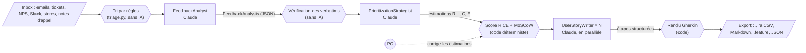

# HOWHY — comment c'est construit, et pourquoi

Ce document explique l'architecture de l'AI Product Owner Assistant et **les raisons de chaque décision** :
ce qui a été choisi, pourquoi, ce qui a été écarté, et à quel prix. Il sert de support pour présenter
le projet ou répondre à une revue technique.

Sommaire : [1. Le cas d'usage](#1-le-cas-dusage) · [2. Vue d'ensemble](#2-vue-densemble) ·
[3. Le parcours d'une analyse](#3-le-parcours-dune-analyse) · [4. Les décisions](#4-les-décisions) ·
[5. Sécurité](#5-sécurité) · [6. Limites connues](#6-limites-connues) ·
[7. Adéquation à la consigne](#7-adéquation-à-la-consigne) · [8. Glossaire](#8-glossaire)

---

## 1. Le cas d'usage

> *You work for a SaaS startup that develops a project management platform. The Product Owner is
> overwhelmed with client feedback, feature requests, and must constantly prioritize the backlog.
> They need an intelligent assistant to help with their decisions.*

Dans la démo, la startup s'appelle **Orbit** (fictive). Elle édite une plateforme de gestion de projets :
planification, diagrammes de Gantt, charge des équipes, pour des PME et des ETI.

Le problème du PO n'est pas de manquer d'idées, c'est d'en recevoir trop, par trop de canaux, sous des
formes trop différentes : un email en colère, un ticket support, une note NPS, une remarque d'un commercial,
un avis sur un store. L'assistant fait le **travail de fond** en trois temps :

1. **Analyser** : lire, séparer, classer et regrouper les retours, en gardant les preuves.
2. **Prioriser** : estimer la valeur et le coût de chaque besoin, puis classer (RICE et MoSCoW).
3. **Rédiger** : produire des user stories prêtes pour Jira, avec des critères d'acceptation testables.

Le PO garde la décision : il peut corriger chaque estimation, et tout se recalcule.

---

## 2. Vue d'ensemble

| Couche | Fichiers | Rôle |
|---|---|---|
| Interface | `app.py`, `ui/` | Écrans Streamlit uniquement : aucune logique métier |
| Métier | `agents.py` | Contrats de données, prompts, passerelle Claude, 3 agents, scoring, orchestrateur |
| Règles | `triage.py`, `governance.py` | Tri de l'Inbox, quotas, modèles de coût |
| Données | `store.py`, `supabase/` | Persistance (Supabase ou SQLite), schéma SQL et règles de sécurité |
| Analytique | `analytics.py` | Requêtes SQL de la console admin (DuckDB) |
| Accès | `auth.py`, `config.py` | Connexion et configuration |

Principe directeur : **`agents.py` n'importe pas Streamlit**. Le même pipeline pourrait tourner dans une API,
un job nocturne ou un bot Slack sans changer une ligne de logique.

---

## 3. Le parcours d'une analyse

Pour chaque étape : ce qui se passe, et **si c'est de l'IA ou non**.

| Étape | Ce qui se passe | IA ? |
|---|---|---|
| Inbox | Le texte brut est découpé en messages, chaque message reçoit un canal et un indicateur d'urgence | **Non** : règles |
| Contrôle du quota | Le coût du run est estimé, puis comparé aux limites de l'utilisateur | **Non** : ML classique + règles |
| Analyse | Claude lit tout, sépare, classe, regroupe par problème et cite des verbatims | **Oui** : IA générative |
| Validation | Le JSON est validé : format, règles métier, une correction autorisée | **Non** |
| Vérification des verbatims | Chaque citation est recherchée mot pour mot dans le texte source | **Non** |
| Priorisation | Claude estime Reach, Impact, Confidence et Effort, avec une justification | **Oui** : IA générative |
| Score et classement | RICE, seuils MoSCoW, contrainte non négociable, ordre du backlog | **Non** : calcul |
| Rédaction | Claude écrit persona, besoin, bénéfice, scénarios, points et découpage | **Oui** : IA générative |
| Gherkin | Given / When / Then / And assemblés par le code à partir des étapes | **Non** |
| Export | CSV Jira, Markdown, `.feature`, JSON | **Non** |
| Journal | Chaque requête à Claude est enregistrée : durée, tokens, réflexion résumée | **Non** (mais elle contient la réflexion de l'IA) |

Règle de conception : **l'IA est utilisée là où il faut du jugement sur du texte non structuré, jamais là où
il faut un calcul, un format exact ou une décision auditable.**

---

## 4. Les décisions

Chaque décision suit le même format : **ce qui a été décidé**, **pourquoi**, **ce qui a été écarté**, **le compromis**.

### D1. Trois agents spécialisés, orchestrés par le code
- **Décision** : un pipeline fixe, Analyste → Stratège → Rédacteur. Chaque agent fait un appel à Claude, avec un seul rôle et un format de sortie strict.
- **Pourquoi** : chaque étape a un objectif différent (lire, juger, écrire) et donc un prompt, un niveau de raisonnement et un contrôle adaptés. Les erreurs se localisent facilement : on sait quel agent a produit quoi.
- **Écarté** :
  - *Un seul prompt géant* : moins fiable, impossible à valider étape par étape, et le moindre défaut oblige à tout relancer.
  - *Un agent autonome qui choisit ses outils* : imprévisible en coût et en durée, pour une tâche dont les étapes sont connues à l'avance.
- **Compromis** : moins flexible qu'un agent autonome. Mais pour un flux connu, un enchaînement explicite est plus simple, plus rapide et plus testable.

### D2. Sorties structurées, validées, avec une correction
- **Décision** : chaque agent répond en JSON contraint par un schéma généré depuis les modèles Pydantic (`output_config.format`, appliqué côté API). La réponse est ensuite validée par Pydantic puis par des règles métier. En cas d'échec, l'erreur est renvoyée à Claude **une fois**, puis l'app échoue proprement.
- **Pourquoi** : l'interface et les exports ne doivent jamais casser sur une réponse inattendue. Les échelles sont des listes fermées (Impact ∈ {1…5}, points ∈ Fibonacci), donc une valeur hors échelle est impossible.
- **Écarté** : parser du texte libre avec des expressions régulières, trop fragile.
- **Compromis** : une correction coûte un appel de plus. C'est rare, et c'est visible dans le journal des agents.

### D3. Le LLM estime, le code calcule
- **Décision** : Claude fournit les **entrées** RICE et leur justification. Le **score**, le **MoSCoW** et le **classement** sont calculés en Python (`compute_rice`, `moscow_bucket`, `score_portfolio`).
- **Pourquoi** : un modèle de langage calcule mal et de façon instable. Le calcul en code est reproductible, testé et auditable. Surtout, le **PO peut corriger une estimation** et tout se recalcule instantanément, sans appel à l'IA.
- **Écarté** : demander directement le score ou le classement à l'IA, car on ne pourrait ni l'expliquer ni le corriger.
- **Compromis** : la qualité dépend des estimations, en particulier du Reach, déduit des mentions. D'où les justifications obligatoires.

### D4. RICE et MoSCoW combinés
- **Décision** :
  - MoSCoW est dérivé du score RICE, **relativement au meilleur score du lot** : Must ≥ 60 %, Should ≥ 30 %, Could ≥ 10 %.
  - Une **contrainte non négociable** (légal, sécurité, contrat) force *Must*.
  - L'ordre du backlog suit le MoSCoW, puis le RICE.
- **Pourquoi** : RICE sous-pondère les obligations. Un SSO exigé par une DSI touche peu d'utilisateurs, mais sans lui le client part. C'est exactement le cas F4 de la démo.
- **Écarté** : RICE seul (il rate les obligations) ou MoSCoW seul (subjectif, non chiffré).
- **Compromis** : les seuils relatifs sont un choix de conception, pas un standard. Le vrai MoSCoW se négocie avec les parties prenantes.

### D5. Gherkin assemblé par le code
- **Décision** : le rédacteur renvoie des listes d'étapes (`given[]`, `when[]`, `then[]`), et le texte Given / When / Then / And est construit par le code.
- **Pourquoi** : la syntaxe est garantie. Le fichier `.feature` est directement utilisable par Cucumber ou Behave.
- **Écarté** : laisser l'IA écrire le Gherkin en texte libre, avec des mots-clés dupliqués ou manquants.

### D6. Tri de l'Inbox par règles, sans IA
- **Décision** : `triage.py` découpe le texte en messages et détecte le canal et l'urgence : « URGENT », ticket de priorité haute, NPS ≤ 4, avis ≤ 2 étoiles, renouvellement, risque légal, deal perdu.
- **Pourquoi** : c'est instantané, gratuit et explicable, et suffisant pour **trier**. C'est aussi ce que font les vrais outils de support avant qu'un humain, ou une IA, regarde le fond. Cela alimente le message d'accueil (« 10 notifications, dont 5 en urgence »).
- **Écarté** : un appel à l'IA au chargement de l'Inbox (latence, coût, pour un tri grossier).
- **Compromis** : les règles ratent les nuances. Dans le cas « Onboarding », un déploiement de 900 licences n'est pas marqué urgent par les règles, mais l'analyste IA le repère. C'est un bon exemple pour expliquer la complémentarité.

### D7. Vérification des verbatims (*grounding*)
- **Décision** : chaque citation présentée comme un verbatim est recherchée **mot pour mot** dans le texte source. La casse, les guillemets typographiques et les espaces sont ignorés, et les coupures « … » sont autorisées. L'écran indique « vérifié dans la source » ou « introuvable tel quel : possible paraphrase ».
- **Pourquoi** : un modèle de langage peut reformuler une citation, voire l'inventer (*hallucination*). Un PO doit pouvoir montrer une preuve exacte à ses parties prenantes. Ce contrôle est déterministe, gratuit et visible.
- **Écarté** : faire vérifier les citations par une seconde IA (coûteux, et le vérificateur peut lui-même se tromper).
- **Compromis** : une citation correcte mais retouchée (ponctuation, faute corrigée) peut être signalée à tort. C'est un faux positif prudent.

### D8. Le modèle et le raisonnement
- **Décision** : Claude **Sonnet 5**. Claude 3.5 Sonnet, demandé initialement, a été retiré de l'API en octobre 2025 ; Sonnet 5 est son successeur. On utilise le **raisonnement adaptatif** (le modèle décide combien réfléchir) avec un **niveau d'effort par agent** : moyen pour l'analyste et le rédacteur, élevé pour le stratège, dont les scores conditionnent toute la suite.
- **Pourquoi** : le bon compromis qualité / coût / latence pour de la compréhension de texte et du jugement. L'effort se règle sans changer de modèle.
- **Réflexion affichée** : l'API renvoie un **résumé** du raisonnement (`display: "summarized"`), jamais le raisonnement brut. C'est ce résumé qui apparaît dans le journal des agents.
- **Écarté** : un modèle plus puissant (Opus) partout, plus cher et plus lent sans gain net sur cette tâche. On peut le changer via `ANTHROPIC_MODEL`.

### D9. Les user stories en parallèle
- **Décision** : les stories sont rédigées simultanément (4 en parallèle au maximum).
- **Pourquoi** : elles sont indépendantes. La durée totale devient environ analyste + stratège + la story la plus lente, au lieu de la somme de toutes. La chronologie du journal des agents le montre.
- **Compromis** : plus de tokens par minute consommés d'un coup. Sur un compte neuf aux limites basses, on peut passer à 1 (`STORY_WORKERS=1`).

### D10. Streamlit pour l'interface
- **Décision** : Streamlit, imposé par la stack, avec un design éditorial et sobre :
  - un seul accent vert profond (`#1F6E57`, `#14352C` pour les bandeaux), fond beige `#F4F1EA`, encre `#1C1B19` ;
  - titres en serif (Newsreader), interface en Geist, chiffres en Geist Mono ;
  - mode clair sur fond beige avec des cartes papier plus claires, pour éviter l'éblouissement du blanc ;
  - aucun emoji.

  Une palette aux couleurs de Thiga (indigo et framboise) a été essayée puis écartée : trop voyante pour un outil de travail.

  Les couleurs des graphiques ont été choisies pour rester distinctes pour les daltoniens et contrastées sur les deux fonds. Les accents qui dépendent du thème sont des variables CSS basculées par l'interrupteur Clair / Sombre.
- **Pourquoi** : c'est le moyen le plus rapide de livrer une application de données interactive en Python.
- **Compromis** : Streamlit réexécute le script à chaque interaction. D'où les caches par session (quotas, données admin) et l'état stocké dans `st.session_state`.

### D11. Authentification Supabase et sécurité dans la base
- **Décision** :
  - Connexion email / mot de passe avec **Supabase Auth**, inscriptions désactivées : seuls les comptes créés par l'admin peuvent entrer.
  - L'app est **fermée par défaut** : sans configuration, rien ne s'affiche.
  - Les droits sont appliqués **dans PostgreSQL** par des règles **RLS (Row Level Security)**.
- **Pourquoi** : le dépôt est public et l'app est en ligne. Mettre la sécurité dans la base, et non dans l'interface, garantit qu'un membre ne peut ni lire les données des autres, ni modifier ses quotas, ni se promouvoir admin, même en appelant l'API directement. Ces règles sont **testées** (`supabase/tests/10_rls_test.sql`) sur un vrai PostgreSQL à chaque push.
- **Détails** :
  - Chaque session de navigateur a son propre client Supabase, jamais partagé entre visiteurs.
  - Seule la clé *publishable* est utilisée ; l'app refuse la clé secrète.
  - Un blocage de 60 s s'active après 5 échecs de connexion.

### D12. Gouvernance des coûts : quotas, plafond et estimation
- **Décision** :
  - Chaque run est enregistré avec ses tokens et son coût en euros.
  - **Avant** un run, son coût est estimé puis comparé aux limites de l'utilisateur (par requête, jour, semaine, mois).
  - **Pendant** le run, un plafond est vérifié avant chaque appel à Claude.
- **Pourquoi** : l'app est ouverte à des relecteurs avec votre clé API ; un usage non maîtrisé coûterait de l'argent réel.
- **Estimation** : une **régression linéaire** (ML classique) prédit le coût à partir de la taille du texte et du nombre de stories. Tant qu'il y a moins de 8 runs, une estimation a priori prend le relais.
- **Écarté** : des quotas en nombre de runs, moins justes (un run de 30 000 caractères coûte 5 fois plus qu'un run de 5 000).

### D13. Le journal des agents (observabilité)
- **Décision** : chaque requête envoyée à Claude est enregistrée dans `agent_calls` : agent, début, durée, tentative, statut, raison d'arrêt, tokens, **réflexion résumée**, extrait de la sortie.
- **Pourquoi** : on voit ce que fait chaque agent, combien de temps il prend, quand une réponse a été corrigée, et pourquoi le modèle a conclu ce qu'il a conclu. C'est la base de toute optimisation de latence ou de coût.
- **Compromis** : la réflexion peut contenir des extraits de retours clients. Elle n'est donc lisible que par les admins (RLS).

### D14. SQL analytique avec DuckDB
- **Décision** : les données d'usage sont chargées depuis Supabase (sous RLS), puis analysées en SQL avec **DuckDB**, un moteur SQL embarqué. Chaque graphique affiche sa requête.
- **Pourquoi** : du vrai SQL, lisible et montrable, sans exposer de connexion directe à la base ni multiplier les vues côté serveur.
- **Compromis** : adapté à des volumes de POC. À grande échelle, on pousserait ces agrégations dans des vues PostgreSQL.

### D15. Le mode démo
- **Décision** : un résultat pré-calculé pour le cas « Notifications & churn », rejoué sans appel à l'IA.
- **Pourquoi** : une démo live ne doit pas dépendre du réseau.
- **Limite importante** : ce résultat a été **rédigé à la main** comme référence. Pour le remplacer par un vrai run, lancez l'analyse en direct sur ce cas, téléchargez « JSON typé » dans l'onglet Export, et enregistrez-le sous `data/demo_result.json`.

### D16. Les tests
- **Décision** :
  - 62 tests hors ligne, sur un faux client Claude : aucune clé, aucun coût, moins de 15 secondes.
  - Tests d'interface avec `AppTest` : connexion, droits, lancement.
  - Tests SQL des règles de sécurité sur PostgreSQL.
  - Lint avec `ruff`.
  - Le tout en CI GitHub Actions.
- **Pourquoi** : pouvoir modifier un prompt, une règle ou l'interface en sachant tout de suite ce qui casse.

### D17. La progression en direct (streaming)
- **Décision** : l'analyste et le stratège reçoivent leur réponse en *streaming*. Pendant qu'ils travaillent, l'écran affiche :
  - le résumé de leur réflexion, qui s'écrit au fil de l'eau ;
  - les éléments déjà trouvés : les thèmes et les features pour l'analyste, les features notées (impact, effort) pour le stratège.

  Le JSON encore incomplet est lu en mode partiel, et un élément n'apparaît qu'une fois ses champs terminés. Le mode démo rejoue le même affichage à partir du résultat enregistré.
- **Pourquoi** : un run dure plusieurs dizaines de secondes. Voir l'IA avancer rend l'attente lisible et montre que le résultat se construit à partir des retours collés.
- **Compromis** :
  - Le streaming ne rend pas le run plus rapide, il rend seulement l'attente visible.
  - Les rédacteurs de user stories ne sont pas streamés : ils tournent en parallèle dans d'autres threads, et Streamlit ne peut mettre à jour l'écran que depuis le thread principal. Chaque story terminée est signalée.
  - L'affichage est best effort : s'il échoue, il se coupe sans interrompre l'agent.
  - Chaque utilisateur ne voit que la réflexion portant sur les retours qu'il a lui-même collés. Le journal complet reste réservé aux admins.

---

## 5. Sécurité

| Risque | Parade |
|---|---|
| Accès anonyme | Authentification obligatoire, app verrouillée par défaut |
| Un membre lit les données d'un autre | RLS dans PostgreSQL, testée |
| Un membre augmente ses quotas | Aucune règle ne lui permet de modifier son profil |
| Clé API exposée | Clé stockée dans les secrets Streamlit, jamais dans le dépôt ni dans le navigateur |
| Clé Supabase trop puissante | L'app refuse les clés `service_role` / `sb_secret_` |
| Injection de prompt dans les retours | Les retours sont balisés comme **données** et le prompt demande de ne pas suivre d'instructions qu'ils contiendraient |
| Contenu généré malveillant (HTML) | Tout texte produit par l'IA est échappé avant l'affichage |
| Explosion des coûts | Quotas par utilisateur, plafond pendant le run, plafond mensuel sur la Console Claude |
| Force brute | Blocage temporaire après 5 échecs, en plus des limites de Supabase |

---

## 6. Limites connues

- **Estimations** : le Reach et l'Effort sont les estimations les plus fragiles. Le Reach est déduit des mentions, et l'Effort est estimé sans connaître le code du produit : l'équipe technique doit le valider.
- **Seuils MoSCoW** : relatifs au lot analysé, donc un choix de conception.
- **Mode démo** : son résultat est rédigé à la main (voir D15).
- **Tri de l'Inbox** : par règles, donc grossier (voir D6).
- **Pas de connecteurs** : dans le POC, les retours sont collés à la main. En production, ils arriveraient par API : Zendesk, messagerie, outil NPS, Slack, stores, CRM.
- **Pas de mémoire** : l'outil ne sait pas ce qui est déjà livré ou en cours, donc il peut re-prioriser l'existant.
- **Pas d'évaluation continue** : il manque un jeu de retours annotés pour mesurer la qualité à chaque changement de prompt.

---

## 7. Adéquation à la consigne

Une relecture critique : est-ce que le POC répond à ce qui est demandé, où s'en écarte-t-il, et qu'a-t-il en plus ?

### 7.1 Ce qui est demandé, et ce que fait le POC

| Demande de la consigne | Réponse du POC | Statut |
|---|---|---|
| Une startup SaaS qui édite une plateforme de gestion de projets | Orbit (fictive) : planification, Gantt, charge des équipes, clients PME et ETI. 3 cas prêts à l'emploi | Couvert |
| Un PO submergé par les retours clients et les demandes | Inbox multicanale (emails, tickets, NPS, Slack, stores, notes d'appel), triée instantanément par règles | Couvert |
| Module 1 : analyser les retours | `FeedbackAnalyst` : thèmes, demandes formulées comme des problèmes, autres signaux, verbatims vérifiés mot pour mot | Couvert |
| Module 2 : prioriser avec un RICE justifié | `PrioritizationStrategist` estime R, I, C et E avec une justification par critère ; le code calcule le score. Le PO peut corriger chaque estimation | Couvert |
| Module 3 : rédiger des user stories avec critères Gherkin | `UserStoryWriter` : persona, besoin, bénéfice, points, 3 à 6 scénarios Gherkin ; export Jira et `.feature` | Couvert |
| Aider le PO à décider | L'IA prépare, le PO tranche : estimations modifiables, recalcul instantané, preuves visibles | Couvert |
| Interface Streamlit | Oui | Couvert |
| Claude 3.5 Sonnet | Claude Sonnet 5 | Écart assumé (7.2) |

### 7.2 Les écarts assumés

- **Le modèle.** Claude 3.5 Sonnet a été retiré de l'API en octobre 2025 : il ne peut plus être appelé. Sonnet 5 est son successeur dans la même gamme (voir D8).
- **MoSCoW en plus de RICE.** La consigne demande RICE. MoSCoW est ajouté parce que RICE seul classe mal les obligations (le SSO du cas de démo). Ses seuils, relatifs au meilleur score, sont un choix de conception (voir D4).
- **Le résultat de démo.** Il est rédigé à la main pour l'instant. Il sera remplacé par un vrai run avant la présentation (voir D15).

### 7.3 Ce qui dépasse la consigne, et pourquoi

| Ajout | Pourquoi il est là | Place dans la présentation |
|---|---|---|
| Tri de l'Inbox par règles | Répond directement au « PO submergé » : il voit tout de suite ce qui est urgent | Au cœur |
| Vérification des verbatims | Rend l'analyse digne de confiance : chaque preuve est vérifiable | Au cœur |
| Exports Jira, Markdown, `.feature` | Les stories quittent l'outil et entrent dans le flux de l'équipe | Au cœur |
| Progression en direct | Rend l'attente lisible pendant un run | En passant |
| Authentification et RLS | L'app est en ligne, le dépôt est public, la clé API est payante : sans cela, impossible d'ouvrir l'app aux relecteurs | Une phrase |
| Quotas et estimation du coût | Même raison : maîtriser la dépense réelle | Une phrase |
| Console admin (SQL, prévision) et journal des agents | Piloter les coûts et comprendre ce que fait chaque agent | Seulement si le jury pose la question |

### 7.4 Verdict

- **Le cœur de la consigne est entièrement couvert** : les trois modules fonctionnent de bout en bout, sur Claude et Streamlit.
- **Les ajouts ne concurrencent pas le sujet.** Soit ils servent directement le PO (tri, preuves, exports), soit ils rendent possible une démo ouverte et sûre (connexion, quotas, admin).
- **Le risque est de paraître sur-dimensionné.** La parade : présenter d'abord les trois modules, puis l'infrastructure en une minute. La logique métier tient dans un seul fichier (`agents.py`), sans dépendance à l'interface.
- **Ce qui manquerait pour un vrai usage** (connecteurs, mémoire du backlog existant, évaluation continue) est listé dans les limites connues (section 6) et relève de la feuille de route, pas du POC.

---

## 8. Glossaire

| Terme | Définition |
|---|---|
| **PO (Product Owner)** | Responsable du produit dans une équipe agile : il décide quoi construire et dans quel ordre, et rédige le backlog. |
| **Backlog** | Liste ordonnée de tout ce que l'équipe pourrait construire. |
| **User story** | Besoin exprimé du point de vue de l'utilisateur : *As a [rôle], I want to [action], so that [bénéfice].* |
| **Critères d'acceptation** | Conditions vérifiables qui permettent de dire qu'une story est terminée. |
| **Gherkin** | Format standard pour écrire ces critères : *Given* (contexte), *When* (action), *Then* (résultat attendu). Lisible par un humain et exécutable par des outils de test (Cucumber, Behave). |
| **INVEST** | Qualités d'une bonne story : Indépendante, Négociable, porteuse de Valeur, Estimable, Petite (*Small*), Testable. |
| **Story points** | Estimation relative de l'effort, souvent sur la suite de Fibonacci (1, 2, 3, 5, 8, 13). |
| **RICE** | Méthode de priorisation d'Intercom : **R**each (combien de personnes touchées), **I**mpact (effet sur chacune), **C**onfidence (solidité des preuves), **E**ffort (coût). Score = R × I × C ÷ E. |
| **MoSCoW** | Classement en **M**ust have, **S**hould have, **C**ould have, **W**on't have (pas ce cycle). |
| **NPS (Net Promoter Score)** | Enquête de satisfaction : « Recommanderiez-vous ce produit, de 0 à 10 ? », souvent avec un commentaire libre. Ceux qui répondent 0 à 6 sont des détracteurs, 9 ou 10 des promoteurs. Les commentaires sont une mine de retours. |
| **Zendesk** | Logiciel de support client très répandu : chaque demande devient un **ticket** numéroté, avec une priorité et un statut. |
| **Intercom** | Outil de chat intégré aux sites et applications, souvent utilisé pour le support et l'onboarding. |
| **Diagramme de Gantt** | Planning en barres horizontales : chaque tâche est une barre sur un axe de temps. C'est l'une des vues centrales d'un outil de gestion de projets. La chronologie du journal des agents est un petit Gantt. |
| **CSM (Customer Success Manager)** | Personne qui accompagne les clients après la vente pour qu'ils réussissent avec le produit, et qu'ils renouvellent. |
| **QBR (Quarterly Business Review)** | Réunion trimestrielle entre un CSM et un client pour faire le bilan. |
| **Churn** | Perte de clients, par non-renouvellement ou résiliation. |
| **Mid-Market** | Segment des entreprises de taille intermédiaire. |
| **SSO, SAML, SCIM** | Authentification unique via l'annuaire de l'entreprise (SSO), protocole standard pour la mettre en place (SAML), protocole de création et suppression automatique des comptes (SCIM). |
| **Jira** | Outil de gestion de backlog et de tickets le plus répandu chez les équipes produit. |
| **LLM** | Grand modèle de langage, par exemple Claude. |
| **Prompt / prompt système** | Les instructions données au modèle. Le prompt système définit le rôle et la méthode de chaque agent. |
| **Token** | Unité de texte facturée par l'API, environ ¾ d'un mot. |
| **Sortie structurée (structured output)** | Réponse du modèle contrainte par un schéma JSON. |
| **Raisonnement adaptatif / effort** | Le modèle réfléchit avant de répondre, en décidant lui-même combien. L'*effort* règle la profondeur de cette réflexion. |
| **Hallucination / grounding** | Hallucination : contenu inventé par le modèle. Grounding : vérifier qu'une affirmation s'appuie bien sur la source. |
| **Supabase** | Plateforme qui fournit une base PostgreSQL, l'authentification et une API. |
| **RLS (Row Level Security)** | Règles de PostgreSQL qui filtrent, ligne par ligne, ce que chaque utilisateur peut lire ou écrire. |
| **JWT** | Jeton signé qui prouve l'identité de l'utilisateur connecté à chaque requête. |
| **DuckDB** | Moteur SQL embarqué, très rapide pour l'analyse de données. |
| **Régression linéaire (OLS)** | Modèle statistique qui ajuste une droite, ou un plan, aux données. Utilisé ici pour prédire le coût d'un run. |
| **P90** | Valeur en dessous de laquelle tombent 90 % des cas : une estimation « haute ». |
