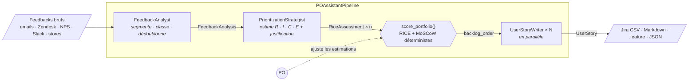
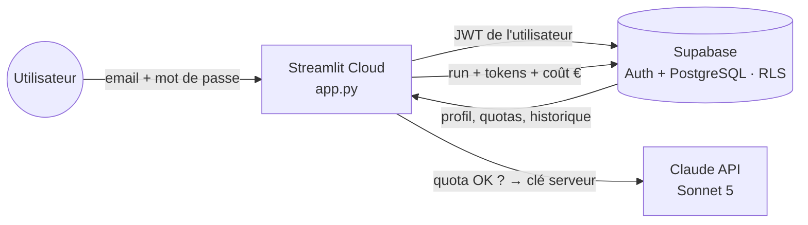

# AI Product Owner Assistant

> **Du feedback client brut au backlog Jira priorisé — en une minute.**
> Trois agents Claude transforment un mélange d'emails, de tickets Zendesk, de verbatims NPS et de notes d'appel en **priorités RICE justifiées** et en **user stories Gherkin** prêtes pour le sprint.

POC réalisé pour **Thiga**. Cas d'usage : une startup SaaS qui édite une plateforme de gestion de projets (« EwokAI », fictive), dont le Product Owner est submergé de retours clients.

L'architecture et **les raisons de chaque décision** sont détaillées dans **[HOWHY.md](HOWHY.md)**, qui contient aussi un glossaire.

 Stack : Python · Streamlit · API Anthropic (Claude Sonnet 5) · Supabase (Auth + PostgreSQL/RLS) · DuckDB.

---

## Démarrage local en 1 minute

```bash
python -m venv .venv && source .venv/bin/activate
pip install -r requirements.txt
cp .env.example .env    # puis : AUTH_MODE=local et LOCAL_DEV_PASSWORD=<votre choix>
streamlit run app.py
```

En mode `local`, deux comptes sont créés dans une base SQLite : `admin@local.dev` (admin) et `demo@local.dev` (membre avec quotas). Sans clé Anthropic, le **mode démo hors-ligne** rejoue un vrai run Claude enregistré (Sonnet 5, 26/09/2026) ; c'est un filet de sécurité pour les démos live quand le réseau lâche.

Trois jeux de feedbacks « mot pour mot » sont préchargés : *Notifications & churn*, *Onboarding et migration*, *Mobile terrain et performance*. À la première connexion, un **onboarding en 3 étapes** (découvrir, choisir un cas, lancer) démarre la démo. Chaque onglet affiche ensuite l'étape suivante du parcours.

---

## Architecture





| Fichier | Rôle |
|---|---|
| [`app.py`](app.py) | Point d'entrée Streamlit : garde d'authentification, espace PO (5 onglets), Connecteurs, onglet Admin |
| [`agents.py`](agents.py) | Logique métier : contrats Pydantic, prompts, passerelle Claude, 3 agents, orchestrateur, scoring, plafond budgétaire |
| [`governance.py`](governance.py) | Quotas (requête / jour / semaine / mois), fenêtres calendaires, **modèles ML** de coût et de prévision |
| [`store.py`](store.py) | Persistance de l'usage : `SupabaseRepository` (RLS) ou `SQLiteRepository` (dev) |
| [`auth.py`](auth.py) | Authentification Supabase (email + mot de passe) ou locale, fermée par défaut |
| [`analytics.py`](analytics.py) | Requêtes SQL (DuckDB) de la console admin, affichées telles quelles dans l'UI |
| [`reload_guard.py`](reload_guard.py) | Recharge les modules modifiés par un déploiement sans redémarrer le serveur |
| [`ui/`](ui/) | Écrans : `login`, `admin`, `theme` (bascule clair/sombre), `session`, `style` |
| [`supabase/`](supabase/) | Migration SQL (tables, RLS, trigger) + tests des policies |
| [`config.py`](config.py) · [`exporters.py`](exporters.py) · [`samples.py`](samples.py) | Configuration, exports Jira / Markdown / Gherkin / JSON, feedbacks de démo |
| [`triage.py`](triage.py) | Tri instantané de l'Inbox par règles (canal, urgence), sans IA |
| [`connectors.py`](connectors.py) | Feuille de route des connecteurs (Zendesk, Jira, Outlook…), affichée dans l'onglet Connecteurs |
| [`tests/`](tests/) | 56 tests hors-ligne (LLM simulé, UI via `AppTest`) + tests SQL des policies RLS en CI |

`agents.py` ne dépend pas de Streamlit : le même pipeline peut tourner dans un job batch, une API FastAPI ou un bot Slack.

---

## Choix techniques

**1. Le LLM estime, le code calcule.**
Claude produit les *entrées* RICE (Reach %, Impact 1-5, Confidence 50/80/100, Effort 1-5) avec une justification qui cite la grille et la preuve. Le **score**, le **classement** et le **MoSCoW** sont calculés par des fonctions Python pures (`compute_rice`, `moscow_bucket`, `score_portfolio`). Le résultat est reproductible, testable et auditable, et le PO peut **surcharger n'importe quelle estimation** dans l'UI : tout est recalculé instantanément (human-in-the-loop).

**2. Des sorties structurées de bout en bout.**
Chaque agent répond en JSON contraint par un JSON Schema généré depuis les modèles Pydantic (`output_config.format`, décodage contraint côté API). Les échelles sont des `Literal` (Impact ∈ {1..5}, Story points ∈ Fibonacci…). Le tableau `st.dataframe` ne peut donc pas casser sur une valeur inattendue.

**3. Validation métier avec auto-correction.**
Au-delà du schéma, des règles métier sont vérifiées : chaque feature scorée exactement une fois, chaque scénario avec au moins un Given/When/Then, etc. En cas d'échec, l'erreur est renvoyée à Claude pour **une** correction guidée, puis on échoue proprement avec un message clair.

**4. Du Gherkin valide par construction.**
Le rédacteur produit des *étapes structurées* (`given[]`, `when[]`, `then[]`). Le rendu `Given / When / Then / And` est fait en Python, ce qui garantit la syntaxe et produit des fichiers `.feature` directement utilisables par Cucumber ou Behave.

**5. RICE + MoSCoW, correctement combinés.**
Le MoSCoW est relatif au meilleur score du lot (Must ≥ 60 %, Should ≥ 30 %, Could ≥ 10 %). Une **contrainte non négociable** (sécurité, légal, contrat) force *Must*, parce que RICE sous-pondère structurellement ces sujets. L'ordre du backlog suit le MoSCoW, puis le RICE : dans la démo, le SSO exigé par une DSI passe devant une feature au RICE plus élevé.

**6. Robustesse.**
- Chaque erreur du SDK Anthropic (auth, 404 modèle, 429, 529, 5xx, timeout, réseau) est traduite en `AgentError` typée, avec un message utilisateur, le `request_id` et un indicateur *retryable*.
- `stop_reason` est vérifié avant tout parsing (`refusal`, `max_tokens`).
- Retries SDK avec backoff exponentiel, timeouts configurables.
- Si une story échoue, l'analyse déjà faite n'est pas perdue : les autres stories sont livrées.
- Les feedbacks sont traités comme des **données** (protection contre l'injection de prompt), et toute sortie LLM est échappée avant le rendu HTML.

**7. Modèle et raisonnement.**
La consigne laisse le choix du modèle : **Claude Sonnet 5** est utilisé avec **adaptive thinking** et un niveau d'`effort` propre à chaque agent : `high` pour le stratège, dont les scores pilotent tout le reste, et `medium` pour l'extraction et la rédaction. Le modèle se change dans `ANTHROPIC_MODEL`.

**8. Observabilité.**
Tokens, latence et coût estimé par agent sont affichés dans l'onglet Export.

**9. Sécurité : authentification fermée par défaut, RLS dans la base.**
- Connexion email + mot de passe via **Supabase Auth**. Les inscriptions publiques sont désactivées : seuls les comptes créés par l'admin entrent. Sans configuration Supabase, l'app reste **verrouillée** (*fail closed*).
- Chaque session navigateur a son propre client Supabase et son propre JWT. Il n'est jamais partagé via `st.cache_resource`, ce qui évite qu'une session fuite vers un autre visiteur.
- Les droits sont appliqués **dans PostgreSQL** par des policies **Row Level Security**, pas dans l'UI. Un membre ne lit que ses propres runs, ne peut ni modifier ses quotas ni se promouvoir admin, ni effacer son historique. Les anonymes n'ont accès à rien. L'app n'utilise que la clé *publishable* et jamais la clé `service_role`. Ces règles sont **testées** (`supabase/tests/10_rls_test.sql`, exécutées en CI sur un vrai Postgres).
- Verrouillage temporaire après 5 échecs de connexion, en plus du rate limiting de Supabase.

**10. Gouvernance des coûts.**
- Chaque run (réussi, en erreur ou bloqué) est journalisé avec ses tokens et son coût en € : la table `runs` est la source de vérité des quotas.
- **Avant** un run : le coût est estimé par le modèle ML puis comparé aux limites par requête, jour, semaine et mois de l'utilisateur. S'il dépasse, le run est bloqué avant de dépenser un centime.
- **Pendant** le run : un plafond dur (le reste le plus faible parmi les quotas) est vérifié avant chaque appel à Claude.
- La console admin permet de modifier rôles et quotas par utilisateur, directement dans un tableau.

**11. Console admin (onglet Admin, réservé aux admins).**
- **Usage & coûts** : dépense en €, tokens, runs bloqués, répartition par agent et par utilisateur. Chaque graphique affiche **sa requête SQL** (DuckDB, dialecte PostgreSQL).
- **Prévisions ML** : une régression OLS `coût ≈ β0 + β1·kcar + β2·stories` (R², MAE, prédit vs réel, simulateur) et une projection de la facture de fin de mois (tendance linéaire, bande de prédiction à 80 %).
- **Quotas** : un tableau éditable par utilisateur (€/requête, €/jour, €/semaine, €/mois, vide = illimité).
- **Runs** : chaque analyse avec sa configuration, sa latence par étape, son coût et son classement ; comparaison de deux runs et réouverture d'un résultat.
- La console n'affiche que l'usage réel.

**12. Journal des agents et vérification des verbatims.**
- **Journal des agents** (onglet Admin › Agents) : chaque lancement est visualisé comme un processus (01 Analyste, 02 Stratège, 03 Rédacteurs en parallèle), avec une chronologie et un journal par requête : agent, horodatage, utilisateur, durée, tentative, tokens, **réflexion résumée** renvoyée par Claude et extrait de la sortie.
- **Vérification des verbatims** : chaque citation est recherchée mot pour mot dans les messages d'origine, par du code et non par l'IA. L'écran indique si elle est vérifiée ou introuvable (possible paraphrase).
- **Inbox** : les messages sont listés avec leur canal et un indicateur d'urgence, calculés par des règles avant tout appel à l'IA. Le message d'accueil (« Bonjour … tu as 10 notifications, dont 5 en urgence ») s'appuie sur ce tri.

**13. Design et thème clair / sombre.**
Direction éditoriale et sobre : fond beige, un seul accent vert profond (`#1F6E57`), titres en serif (Newsreader), interface en Geist, chiffres en Geist Mono ; aucun emoji. Le mode clair utilise un fond beige (pas de blanc pur) et des cartes papier plus claires pour un contraste confortable. Les couleurs des graphiques ont été validées pour les daltonismes et le contraste, dans les deux thèmes. Une bascule Clair / Sombre se trouve dans la barre latérale et sur l'écran de connexion. Elle pilote le sélecteur de thème natif de Streamlit : pas de rechargement, la session est conservée, le choix est mémorisé. Les deux palettes sont définies dans `.streamlit/config.toml` et le CSS custom s'adapte aux deux thèmes.

---

## Mise en ligne (Supabase + Streamlit Community Cloud)

**1. Supabase (≈ 5 min)**
1. Créez un projet sur [supabase.com](https://supabase.com).
2. *SQL Editor* : exécutez **dans l'ordre** les fichiers de [`supabase/migrations/`](supabase/migrations/) (`20260925000000_init.sql`, `20260926000000_agent_calls.sql`, puis `20260927000000_run_details.sql`). Chaque fichier peut être relancé sans risque.
3. *Authentication › Sign In / Providers* : désactivez **Allow new users to sign up**.
4. *Authentication › Users › Add user* : créez votre compte et ceux des relecteurs (cochez *Auto Confirm User*).
5. Promouvez-vous admin (*SQL Editor*) :
   ```sql
   update public.profiles
   set role = 'admin', max_eur_per_request = null, daily_eur_limit = null,
       weekly_eur_limit = null, monthly_eur_limit = null
   where email = 'vous@exemple.com';
   ```
6. *Project Settings › API Keys* : copiez l'**URL** du projet et la clé **publishable** (anon).

**2. Streamlit Community Cloud (≈ 3 min)**
1. [share.streamlit.io](https://share.streamlit.io) › *Create app* › ce dépôt, branche `main`, fichier `app.py`.
2. *Advanced settings* : Python 3.12, puis collez vos secrets au format de [`.streamlit/secrets.toml.example`](.streamlit/secrets.toml.example).
3. *Deploy*. Les nouveaux comptes reçoivent des quotas par défaut (0,50 € / requête, 2 € / jour, 5 € / semaine, 10 € / mois), ajustables dans l'onglet Admin.

---

## Configuration

| Variable | Défaut | Rôle |
|---|---|---|
| `ANTHROPIC_API_KEY` | — | Clé API (sans clé : mode démo) |
| `ANTHROPIC_MODEL` | `claude-sonnet-5` | Modèle utilisé par les 3 agents |
| `ANTHROPIC_MAX_TOKENS` | `16000` | Plafond de sortie par requête |
| `ANTHROPIC_TIMEOUT_S` | `180` | Timeout HTTP par requête |
| `ANTHROPIC_MAX_RETRIES` | `2` | Retries automatiques (429 / 5xx / réseau) |
| `STORY_WORKERS` | `4` | Stories rédigées en parallèle |
| `EFFORT_ANALYST` / `_STRATEGIST` / `_WRITER` | `medium` / `high` / `medium` | Profondeur de raisonnement par agent |
| `SUPABASE_URL` / `SUPABASE_KEY` | — | Projet Supabase et clé *publishable* (obligatoires en production) |
| `AUTH_MODE` | `supabase` | `local` = comptes SQLite pour le développement |
| `LOCAL_DEV_PASSWORD` | — | Mot de passe des comptes locaux |
| `USD_TO_EUR` | `0.86` | Taux utilisé pour tous les montants en € |
| `APP_TIMEZONE` | `Europe/Paris` | Calendrier des quotas jour / semaine / mois |
| `ANTHROPIC_CREDITS_USD` | — | Crédit chargé sur la Console Claude : affiche le **crédit restant estimé** (barre latérale admin et onglet Admin) |

Sur Streamlit Community Cloud, déclarez ces variables dans *Secrets* : elles sont exposées comme variables d'environnement.

---

## Qualité

```bash
pip install -r requirements-dev.txt
pytest -q                          # 56 tests : LLM simulé, UI via AppTest, aucune clé ni aucun coût
ruff check . && ruff format --check .
DATABASE_URL=postgresql://postgres@localhost:5432/scratch scripts/test_schema.sh   # migration + RLS
```

La CI GitHub Actions exécute le lint et les tests Python, puis applique la migration sur un PostgreSQL 16 éphémère et vérifie chaque policy RLS.

Couverture : formule RICE, seuils MoSCoW, ordre du backlog, rendu Gherkin, auto-correction de la passerelle, refus et troncatures, mapping des erreurs SDK, plafond budgétaire, quotas et fenêtres calendaires, régression et prévision, dépôt SQLite, requêtes SQL admin, authentification (y compris le *fail closed*), parcours UI connexion → membre → admin.

---

## Pistes pour aller plus loin

- **Connecteurs d'entrée** : Zendesk, Intercom, Gmail, export NPS (webhooks ou batch nocturne via l'API Batches, -50 % de coût).
- **Création Jira directe** par l'API REST au lieu du CSV, avec détection des doublons dans le backlog existant.
- **Mémoire produit** : tenir compte des features déjà livrées ou en cours pour ne pas re-prioriser l'existant.
- **Évaluation continue** : jeu de feedbacks annotés et score de qualité des stories (INVEST, testabilité Gherkin) à chaque changement de prompt.
- **Calibration** : comparer les efforts estimés aux story points réellement consommés pour recalibrer la grille.
