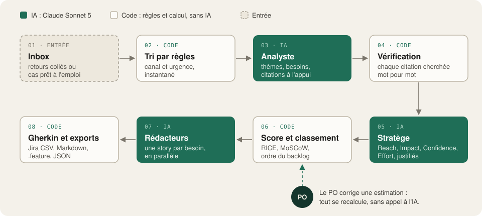

# Journal des décisions techniques

Ce document complète [What, How, Why](what-how-why.md) et [Au-delà de la consigne](au-dela-de-la-consigne.md) pour un lecteur technique : l'architecture, chaque décision et son compromis, la sécurité, les limites et un glossaire.

Sommaire : [1. Vue d'ensemble](#1-vue-densemble) · [2. Les décisions](#2-les-décisions) · [3. Sécurité](#3-sécurité) · [4. Limites connues](#4-limites-connues) · [5. Glossaire](#5-glossaire)

---

## 1. Vue d'ensemble

| Couche | Fichiers | Rôle |
|---|---|---|
| Interface | `app.py`, `ui/` | Écrans Streamlit uniquement : aucune logique métier |
| Métier | `agents.py` | Contrats de données, prompts, passerelle Claude, 3 agents, scoring, orchestrateur |
| Règles | `triage.py`, `governance.py` | Tri de l'Inbox, quotas, modèles de coût |
| Feuille de route | `connectors.py` | Connecteurs prévus pour la production (onglet Connecteurs) |
| Données | `store.py`, `supabase/` | Persistance (Supabase ou SQLite), schéma SQL et règles de sécurité |
| Analytique | `analytics.py` | Requêtes SQL de la console admin (DuckDB) |
| Accès | `auth.py`, `config.py` | Connexion et configuration |

Principe directeur : **`agents.py` n'importe pas Streamlit**. Le même pipeline pourrait tourner dans une API,
un job nocturne ou un bot Slack sans changer une ligne de logique.

---

## 2. Les décisions

Chaque décision suit le même format : **ce qui a été décidé**, **pourquoi**, **ce qui a été écarté**, **le compromis**.

### D1. Trois agents spécialisés, orchestrés par le code
- **Décision** : un pipeline fixe, Analyste → Stratège → Rédacteur. Chaque agent fait un appel à Claude, avec un seul rôle et un format de sortie strict.
- **Pourquoi** : chaque étape a un objectif différent (lire, juger, écrire) et donc un prompt, un niveau de raisonnement et un contrôle adaptés. Les erreurs se localisent facilement : on sait quel agent a produit quoi.
- **Écarté** :
  - *Un seul prompt géant* : moins fiable, impossible à valider étape par étape, et le moindre défaut oblige à tout relancer.
  - *Un agent autonome qui choisit ses outils* : imprévisible en coût et en durée, pour une tâche dont les étapes sont connues à l'avance.
- **Compromis** : moins flexible qu'un agent autonome. Mais pour un flux connu, un enchaînement explicite est plus simple, plus rapide et plus testable.

### D2. Sorties structurées, validées, avec une correction
- **Décision** : chaque agent répond en JSON contraint par un schéma généré depuis les modèles Pydantic (`output_config.format`, appliqué côté API). La réponse est ensuite validée par Pydantic puis par des règles métier. En cas d'échec, l'erreur est renvoyée à Claude **une fois**, puis l'app échoue proprement.
- **Pourquoi** : l'interface et les exports ne doivent jamais casser sur une réponse inattendue. Les échelles sont des listes fermées (Impact ∈ {1…5}, points ∈ Fibonacci), donc une valeur hors échelle est impossible.
- **Écarté** : parser du texte libre avec des expressions régulières, trop fragile.
- **Compromis** : une correction coûte un appel de plus. C'est rare, et c'est visible dans le journal des agents.

### D3. Le LLM estime, le code calcule
- **Décision** : Claude fournit les **entrées** RICE et leur justification. Le **score**, le **MoSCoW** et le **classement** sont calculés en Python (`compute_rice`, `moscow_bucket`, `score_portfolio`).
- **Pourquoi** : un modèle de langage calcule mal et de façon instable. Le calcul en code est reproductible, testé et auditable. Surtout, le **PO peut corriger une estimation** et tout se recalcule instantanément, sans appel à l'IA.
- **Écarté** : demander directement le score ou le classement à l'IA, car on ne pourrait ni l'expliquer ni le corriger.
- **Compromis** : la qualité dépend des estimations, en particulier du Reach, déduit des mentions. D'où les justifications obligatoires.

### D4. RICE et MoSCoW combinés
- **Décision** :
  - MoSCoW est dérivé du score RICE, **relativement au meilleur score du lot** : Must ≥ 60 %, Should ≥ 30 %, Could ≥ 10 %.
  - Une **contrainte non négociable** (légal, sécurité, contrat) force *Must*.
  - L'ordre du backlog suit le MoSCoW, puis le RICE.
- **Pourquoi** : RICE sous-pondère les obligations. Un SSO exigé par une DSI touche peu d'utilisateurs, mais sans lui le client part. C'est exactement le cas F4 de la démo.
- **Écarté** : RICE seul (il rate les obligations) ou MoSCoW seul (subjectif, non chiffré).
- **Compromis** : les seuils relatifs sont un choix de conception, pas un standard. Le vrai MoSCoW se négocie avec les parties prenantes.

### D5. Gherkin assemblé par le code
- **Décision** : le rédacteur renvoie des listes d'étapes (`given[]`, `when[]`, `then[]`), et le texte Given / When / Then / And est construit par le code.
- **Pourquoi** : la syntaxe est garantie. Le fichier `.feature` est directement utilisable par Cucumber ou Behave.
- **Écarté** : laisser l'IA écrire le Gherkin en texte libre, avec des mots-clés dupliqués ou manquants.

### D6. Tri de l'Inbox par règles, sans IA
- **Décision** : `triage.py` découpe le texte en messages et détecte le canal et l'urgence : « URGENT », ticket de priorité haute, NPS ≤ 4, avis ≤ 2 étoiles, renouvellement, risque légal, deal perdu.
- **Pourquoi** : c'est instantané, gratuit et explicable, et suffisant pour **trier**. C'est aussi ce que font les vrais outils de support avant qu'un humain, ou une IA, regarde le fond. Cela alimente le message d'accueil (« 10 notifications, dont 5 en urgence »).
- **Écarté** : un appel à l'IA au chargement de l'Inbox (latence, coût, pour un tri grossier).
- **Compromis** : les règles ratent les nuances. Dans le cas « Onboarding », un déploiement de 900 licences n'est pas marqué urgent par les règles, mais l'analyste IA le repère. C'est un bon exemple pour expliquer la complémentarité.

### D7. Vérification des verbatims (*grounding*)
- **Décision** : chaque citation présentée comme un verbatim est recherchée **mot pour mot** dans le texte source. La casse, les guillemets typographiques et les espaces sont ignorés, et les coupures « … » sont autorisées. L'écran indique « vérifié dans la source » ou « introuvable tel quel : possible paraphrase ».
- **Pourquoi** : un modèle de langage peut reformuler une citation, voire l'inventer (*hallucination*). Un PO doit pouvoir montrer une preuve exacte à ses parties prenantes. Ce contrôle est déterministe, gratuit et visible.
- **Écarté** : faire vérifier les citations par une seconde IA (coûteux, et le vérificateur peut lui-même se tromper).
- **Compromis** : une citation correcte mais retouchée (ponctuation, faute corrigée) peut être signalée à tort. C'est un faux positif prudent.

### D8. Le modèle et le raisonnement
- **Décision** : Claude **Sonnet 5** (la consigne laisse le choix du modèle). On utilise le **raisonnement adaptatif** (le modèle décide combien réfléchir) avec un **niveau d'effort par agent** : moyen pour l'analyste et le rédacteur, élevé pour le stratège, dont les scores conditionnent toute la suite.
- **Pourquoi** : le bon compromis qualité / coût / latence pour de la compréhension de texte et du jugement. L'effort se règle sans changer de modèle.
- **Réflexion affichée** : l'API renvoie un **résumé** du raisonnement (`display: "summarized"`), jamais le raisonnement brut. C'est ce résumé qui apparaît dans le journal des agents.
- **Écarté** : un modèle plus puissant (Opus) partout, plus cher et plus lent sans gain net sur cette tâche. On peut le changer via `ANTHROPIC_MODEL`.
- **Mesure (26/09/2026)**, sur le cas « Notifications & churn » :
  - un run dure 100 à 110 s : analyste ~29 s, stratège ~45 à 50 s, story la plus lente ~30 s, sans aucune correction ;
  - passer le stratège en effort moyen n'a fait gagner que 6 s (13 %), l'ordre de grandeur des variations d'un run à l'autre ;
  - l'effort élevé est donc conservé : le gain ne justifie pas de risquer la qualité des scores, qui conditionnent toute la suite.
- **D'où vient la durée** : chaque agent écrit à environ 95 tokens par seconde, et produit 3 000 à 5 000 tokens. Réduire vraiment la latence demanderait des justifications plus courtes ou un modèle plus rapide, deux compromis sur la qualité. Le streaming (D17) rend l'attente lisible à la place.

### D9. Les user stories en parallèle
- **Décision** : les stories sont rédigées simultanément (4 en parallèle au maximum).
- **Pourquoi** : elles sont indépendantes. La durée totale devient environ analyste + stratège + la story la plus lente, au lieu de la somme de toutes. La chronologie du journal des agents le montre.
- **Compromis** : plus de tokens par minute consommés d'un coup. Sur un compte neuf aux limites basses, on peut passer à 1 (`STORY_WORKERS=1`).

### D10. Streamlit pour l'interface
- **Décision** : Streamlit (la consigne laisse le choix du framework), avec un design éditorial et sobre :
  - un seul accent vert profond (`#1F6E57`, `#14352C` pour les bandeaux), fond beige `#F4F1EA`, encre `#1C1B19` ;
  - titres en serif (Newsreader), interface en Geist, chiffres en Geist Mono ;
  - mode clair sur fond beige avec des cartes papier plus claires, pour éviter l'éblouissement du blanc ;
  - aucun emoji.

  Les couleurs des graphiques ont été choisies pour rester distinctes pour les daltoniens et contrastées sur les deux fonds. Les accents qui dépendent du thème sont des variables CSS basculées par l'interrupteur clair / sombre (icônes soleil et lune).
- **Pourquoi** : c'est le moyen le plus rapide de livrer une application de données interactive en Python.
- **Compromis** : Streamlit réexécute le script à chaque interaction. D'où les caches par session (quotas, données admin) et l'état stocké dans `st.session_state`.
- **Déploiements sans redémarrage** : un serveur Streamlit garde les modules déjà importés. Après une mise à jour, `app.py` pouvait donc être neuf et `agents.py` encore ancien, ce qui provoquait une `ImportError` jusqu'au redémarrage. `reload_guard.py` détecte les fichiers modifiés depuis leur import (date du fichier, ou cache de bytecode au premier passage) et recharge le code du projet. Un test simule le cas.
- **Interface épurée** : l'essentiel reste visible (synthèse, décision MoSCoW, story et ses critères), le reste s'ouvre à la demande (graphiques, justifications, détails, signaux secondaires). La barre latérale se limite au compte, au thème (icônes soleil et lune), au mode démo et au nombre de stories ; les dépenses et le crédit sont dans la console admin. C'est le critère « simplicité et efficacité » de la consigne.
- **Guide de démarrage une seule fois par personne** : une fois vu ou passé, il ne s'ouvre plus aux connexions suivantes, sur n'importe quel appareil. L'information est rangée dans les métadonnées du compte Supabase, que chaque utilisateur peut modifier pour lui-même : ni nouvelle table, ni règle de sécurité à ouvrir. Le bouton « Guide de démarrage » le rouvre à la demande.
- **Ajouts visibles** : les onglets qui dépassent la consigne (Connecteurs, Admin) sont affichés en pâle, avec une légende en bout de barre, tout comme le réglage des modèles réservé à l'admin. On distingue ainsi d'un coup d'œil le sujet de ses extensions (voir [Au-delà de la consigne](au-dela-de-la-consigne.md)).

### D11. Authentification Supabase et sécurité dans la base
- **Décision** :
  - Connexion email / mot de passe avec **Supabase Auth**, inscriptions désactivées : seuls les comptes créés par l'admin peuvent entrer.
  - L'app est **fermée par défaut** : sans configuration, rien ne s'affiche.
  - Les droits sont appliqués **dans PostgreSQL** par des règles **RLS (Row Level Security)**.
- **Pourquoi** : le dépôt est public et l'app est en ligne. Mettre la sécurité dans la base, et non dans l'interface, garantit qu'un membre ne peut ni lire les données des autres, ni modifier ses quotas, ni se promouvoir admin, même en appelant l'API directement. Ces règles sont **testées** (`supabase/tests/10_rls_test.sql`) sur un vrai PostgreSQL à chaque push.
- **Détails** :
  - Chaque session de navigateur a son propre client Supabase, jamais partagé entre visiteurs.
  - Seule la clé *publishable* est utilisée ; l'app refuse la clé secrète.
  - Un blocage de 60 s s'active après 5 échecs de connexion.

### D12. Gouvernance des coûts : quotas, plafond et estimation
- **Décision** :
  - Chaque run est enregistré avec ses tokens et son coût en euros.
  - **Avant** un run, son coût est estimé puis comparé aux limites de l'utilisateur (par requête, jour, semaine, mois).
  - **Pendant** le run, un plafond est vérifié avant chaque appel à Claude.
- **Pourquoi** : l'app est ouverte à des relecteurs avec votre clé API ; un usage non maîtrisé coûterait de l'argent réel.
- **Estimation** : une **régression linéaire** (ML classique) prédit le coût à partir de la taille du texte et du nombre de stories. Tant qu'il y a moins de 8 runs, une estimation a priori prend le relais.
- **Écarté** : des quotas en nombre de runs, moins justes (un run de 30 000 caractères coûte 5 fois plus qu'un run de 5 000).

### D13. Le journal des agents (observabilité)
- **Décision** : chaque requête envoyée à Claude est enregistrée dans `agent_calls` : agent, début, durée, tentative, statut, raison d'arrêt, tokens, **réflexion résumée**, extrait de la sortie.
- **Pourquoi** : on voit ce que fait chaque agent, combien de temps il prend, quand une réponse a été corrigée, et pourquoi le modèle a conclu ce qu'il a conclu. C'est la base de toute optimisation de latence ou de coût.
- **Compromis** : la réflexion peut contenir des extraits de retours clients. Elle n'est donc lisible que par les admins (RLS).

### D14. SQL analytique avec DuckDB
- **Décision** : les données d'usage sont chargées depuis Supabase (sous RLS), puis analysées en SQL avec **DuckDB**, un moteur SQL embarqué. Chaque graphique affiche sa requête.
- **Pourquoi** : du vrai SQL, lisible et montrable, sans exposer de connexion directe à la base ni multiplier les vues côté serveur.
- **Compromis** : adapté à des volumes de POC. À grande échelle, on pousserait ces agrégations dans des vues PostgreSQL.

### D15. Le mode démo
- **Décision** : le mode démo rejoue **un vrai run Claude enregistré** sur le cas « Notifications & churn » : Sonnet 5 partout, le 26/09/2026, 110 s, 0,16 €, 14 verbatims sur 14 exacts. La progression en direct (D17) est rejouée avec la vraie réflexion résumée du stratège, et les chiffres affichés (sources, thèmes, n°1) viennent du résultat.
- **Pourquoi** : une démo live ne doit pas dépendre du réseau, et ce qu'elle montre doit être ce que l'IA produit réellement.
- **Pour le mettre à jour** : lancer le cas en direct, télécharger « JSON typé » dans l'onglet Export, et l'enregistrer sous `data/demo_result.json`.
- **Les tests ne s'appuient pas sur ce fichier**, mais sur un résultat de référence figé (`tests/fixtures/reference_result.json`). Changer la démo ne casse donc jamais les tests.

### D16. Les tests
- **Décision** :
  - 78 tests hors ligne, sur un faux client Claude : aucune clé, aucun coût, moins de 30 secondes (dont deux rejeux de la démo, avec leurs pauses).
  - Tests d'interface avec `AppTest` : connexion, droits, lancement.
  - Tests SQL des règles de sécurité sur PostgreSQL.
  - Lint avec `ruff`.
  - Le tout en CI GitHub Actions.
- **Pourquoi** : pouvoir modifier un prompt, une règle ou l'interface en sachant tout de suite ce qui casse.

### D17. La progression en direct (streaming)
- **Décision** : l'analyste et le stratège reçoivent leur réponse en *streaming*. Pendant qu'ils travaillent, l'écran affiche :
  - le résumé de leur réflexion, qui s'écrit au fil de l'eau ;
  - les éléments déjà trouvés : les thèmes et les features pour l'analyste, les features notées (impact, effort) pour le stratège.

  Le JSON encore incomplet est lu en mode partiel, et un élément n'apparaît qu'une fois ses champs terminés. Le mode démo rejoue le même affichage à partir du résultat enregistré.
- **Pourquoi** : un run dure plusieurs dizaines de secondes. Voir l'IA avancer rend l'attente lisible et montre que le résultat se construit à partir des retours collés.
- **Compromis** :
  - Le streaming ne rend pas le run plus rapide, il rend seulement l'attente visible.
  - Les rédacteurs de user stories ne sont pas suivis en direct : ils tournent en parallèle dans d'autres threads, et Streamlit ne peut mettre à jour l'écran que depuis le thread principal. Chaque story terminée est signalée.
  - L'affichage est best effort : s'il échoue, il se coupe sans interrompre l'agent.
  - Chaque utilisateur ne voit que la réflexion portant sur les retours qu'il a lui-même collés. Le journal complet reste réservé aux admins.

### D18. Le choix du modèle Claude, agent par agent
- **Décision** : chaque agent a son modèle et son niveau d'effort. L'admin choisit une **configuration nommée**, chacune avec l'argument qui la justifie, ou règle chaque agent à la main. Les membres gardent la configuration par défaut.

  | Configuration | Analyste · Stratège · Rédacteur | Coût estimé d'un run | Argument |
  |---|---|---|---|
  | Référence | Sonnet 5 · Sonnet 5 (élevé) · Sonnet 5 | 0,16 € (mesuré) | Le meilleur équilibre qualité, coût et latence pour juger du texte |
  | Rédaction sur Haiku | Sonnet 5 · Sonnet 5 (élevé) · Haiku 4.5 | ~0,12 € | La rédaction est la tâche la plus cadrée et produit la moitié des tokens |
  | Plancher de coût | Haiku 4.5 partout | ~0,08 € | Mesurer ce que la qualité perd au prix minimal |

  Les coûts estimés appliquent les prix de chaque modèle au volume de texte du run de référence. Un autre modèle écrit plus ou moins : seul un run réel donne le vrai chiffre, d'où D19.

- **Mesures du 26/09/2026** (cas « Notifications & churn », un run par configuration) :

  | Configuration (analyste · stratège · rédacteur) | Durée | Coût | Tokens écrits | Ce qui se dégrade |
  |---|---|---|---|---|
  | **Sonnet · Sonnet (élevé) · Sonnet** (deux runs) | **110 s** | **0,16 €** | 15 000 | Référence : 14/14 verbatims exacts, 5 besoins, stories de 5 scénarios |
  | Sonnet · Sonnet (moyen) · Sonnet | 100 s | 0,152 € | 14 000 | Rien de visible, gain faible (voir D8) |
  | Sonnet · Sonnet · Haiku | 124 s | 0,132 € | 17 500 | Une story à 7 scénarios (règle : 3 à 6) |
  | Haiku · Sonnet · Haiku | 163 s | 0,130 € | 21 600 | Slack/Teams fondu dans les notifications ; un verbatim retouché ; une story à 8 scénarios |
  | Haiku · Haiku · Haiku (élevé) | 237 s | 0,129 € | 27 100 | Idem, plus une erreur de fait dans la synthèse (le deal Ventura perdu attribué aux notifications au lieu de la vue de charge) |

- **Ce que ces mesures montrent** :
  - **Haiku n'est pas plus rapide ici, il est 1,5 à 2,4 fois plus lent par agent.** Il écrit beaucoup plus : réflexion à budget fixe et réponses plus longues.
  - **Il n'est donc pas deux fois moins cher, seulement 20 % moins cher par run.** Le prix par token est divisé par deux, mais il écrit 15 % à 80 % de tokens en plus. Le bon indicateur est le coût par tâche, pas le prix par token.
  - **Il perd en qualité sur l'analyse** : besoins moins découpés (un backlog moins exploitable), un verbatim retouché (repéré par la vérification D7), une erreur de fait dans la synthèse. Sonnet : tous les verbatims exacts (10 sur 10, puis 14 sur 14).
  - **Et sur la rédaction** : les stories de Haiku prennent 43 à 64 s contre 20 à 29 s ; 2 sur 9 dépassent la règle des 3 à 6 scénarios ; les points sont irréguliers (le SSO à 8 ou 13, une vue d'un sprint à 3 points). Celles de Sonnet respectent la règle (5 scénarios), avec des données concrètes, des résultats mesurables et une découpe en tranches.
  - **Ce qui tient dans toutes les configurations** : le même top 3 (notifications, SSO, vue de charge) et le SSO toujours marqué non négociable. C'est l'effet de D3 : le code calcule le score et applique la règle, donc le classement résiste au choix du modèle.
  - **Les scores RICE varient autant d'un run Sonnet à l'autre qu'entre Sonnet et Haiku** (le Reach du SSO passe de 15 % à 5 % entre deux runs Sonnet). Les écarts fins de score ne départagent donc pas les modèles ; le découpage, l'exactitude et le respect des règles, si.
- **Décision** : **Sonnet 5 partout reste la configuration par défaut.** Les configurations Haiku restent dans la console admin, comme expérience documentée. Limite : un run par configuration ; les écarts de durée, de découpage et d'exactitude sont nets, mais les écarts fins de score RICE sont dans le bruit.
- **Pourquoi** : on n'affecte pas un modèle « au feeling ». Chaque configuration porte une hypothèse (où le jugement compte, où le volume coûte), et l'onglet Runs la vérifie.
- **Adaptations par modèle** :
  - **Haiku 4.5** n'a ni niveau d'effort ni réflexion adaptative : l'effort est traduit en budget de réflexion (aucun en « faible », 2 048 tokens en « moyen », 4 096 en « élevé »).
  - Chaque agent est facturé au prix de son propre modèle, dans les quotas comme dans les estimations.
- **Écartés** :
  - **Opus 5 et Fable 5.1** : surdimensionnés. Lire, regrouper et noter des retours clients avec une grille explicite ne demande pas le modèle le plus puissant. Ils coûteraient 1,5 à 5 fois le run de référence (environ 0,24 € et 0,80 €), sans gain mesuré. Le bon réflexe est l'inverse : partir de Sonnet et vérifier ce que l'on peut confier à Haiku.
  - **D'autres fournisseurs** (modèles open source, etc.) : la consigne le permettrait, mais l'app s'appuie sur des fonctions de l'API Claude (JSON garanti par schéma, réflexion résumée, effort). L'appel au modèle étant isolé dans `agents.py`, c'est une évolution possible, à mesurer avec D19.

### D19. Le suivi des runs (Admin › Runs)
- **Décision** : chaque analyse enregistre, dans la table `run_details`, **sa configuration** (modèle et effort de chaque agent), **le cas** utilisé, **son classement** (rang, RICE, MoSCoW, estimations) et **son résultat complet**. L'onglet *Admin › Runs* liste les runs avec leur latence par étape, leur coût et leur top 3.
- **Comparer deux runs** du même cas affiche :
  - l'écart de durée et de coût ;
  - la durée de chaque étape sur le chemin critique (analyste, stratège, story la plus lente) ;
  - le classement côte à côte, avec un verdict en une phrase : même top 3, ordre différent, ou top 3 modifié.

  Les features sont appariées par leur titre, car leurs identifiants peuvent changer d'un run à l'autre.
- **Pourquoi** : c'est la preuve d'un choix de modèle. Exemple : passer le stratège en effort moyen a fait gagner 10 s et 1 centime (voir D8) ; l'onglet dit en plus si le classement a tenu.
- **En plus** : un run enregistré peut être **rouvert** tel quel, ce qui évite de relancer l'IA pour montrer un résultat.
- **Compromis** : le résultat complet contient les retours clients collés. Il suit donc les mêmes règles RLS que le journal : visible par son auteur et par les admins seulement.

### D20. Les connecteurs, du POC à la production
- **Décision** : un onglet **Connecteurs** montre où le PO brancherait ses outils. Aucun connecteur n'est actif : les boutons « Connecter » restent désactivés, et le POC ne demande jamais d'identifiants tiers.

  | Phase | Connecteurs | Pourquoi dans cet ordre |
  |---|---|---|
  | 1 · Le socle | Zendesk, Jira (entrée et sortie), Outlook / Gmail | L'essentiel des retours arrive par le support et l'email ; le backlog part dans Jira |
  | 2 · La voix du client élargie | Slack / Teams, outil NPS, App Store / Google Play | Plus de volume, des signaux plus courts |
  | 3 · L'enjeu business | Salesforce / HubSpot | Relie chaque besoin à du chiffre d'affaires (deal perdu, renouvellement) |

- **Pourquoi** :
  - Le passage en production est concret : ce que chaque connecteur apporte, comment il s'autorise (OAuth, lecture seule), à quelle fréquence il se synchronise.
  - **Jira fonctionne dans les deux sens.** En sortie, il reçoit les stories validées. En entrée, il donne à l'outil la mémoire du backlog existant, ce qui corrige une limite du POC.
- **Conçu pour s'emboîter** : chaque connecteur préfixe ses éléments du même en-tête que les cas de démo (`[ZENDESK #…]`, `[EMAIL]`…). Le tri par règles (D6) les classe donc sans changement, et un test le vérifie.
- **Principes de production** :
  - accès en lecture seule et minimal ;
  - jetons OAuth gérés côté serveur ;
  - données personnelles pseudonymisées avant l'envoi à Claude (RGPD) ;
  - dédoublonnage entre canaux ;
  - validation du PO avant tout envoi vers Jira.

---

## 3. Sécurité

| Risque | Parade |
|---|---|
| Accès anonyme | Authentification obligatoire, app verrouillée par défaut |
| Un membre lit les données d'un autre | RLS dans PostgreSQL, testée |
| Un membre augmente ses quotas | Aucune règle ne lui permet de modifier son profil |
| Clé API exposée | Clé stockée dans les secrets Streamlit, jamais dans le dépôt ni dans le navigateur |
| Clé Supabase trop puissante | L'app refuse les clés `service_role` / `sb_secret_` |
| Injection de prompt dans les retours | Les retours sont balisés comme **données** et le prompt demande de ne pas suivre d'instructions qu'ils contiendraient |
| Contenu généré malveillant (HTML) | Tout texte produit par l'IA est échappé avant l'affichage |
| Explosion des coûts | Quotas par utilisateur, plafond pendant le run, plafond mensuel sur la Console Claude |
| Force brute | Blocage temporaire après 5 échecs, en plus des limites de Supabase |

---

## 4. Limites connues

- **Estimations** : le Reach et l'Effort sont les estimations les plus fragiles. Le Reach est déduit des mentions, et l'Effort est estimé sans connaître le code du produit : l'équipe technique doit le valider.
- **Seuils MoSCoW** : relatifs au lot analysé, donc un choix de conception.
- **Variabilité des estimations** : deux runs du même modèle sur le même cas donnent des scores RICE différents (le Reach du SSO varie de 5 % à 15 %). Le classement tient grâce aux règles (contrainte non négociable, MoSCoW relatif), mais les chiffres fins ne sont pas stables : ils s'arbitrent en revue, ce que permet la correction des estimations par le PO.
- **Tri de l'Inbox** : par règles, donc grossier (voir D6).
- **Pas de connecteurs actifs** : dans le POC, les retours sont collés à la main. L'onglet Connecteurs montre comment ils arriveraient en production (voir D20).
- **Pas de mémoire** : l'outil ne sait pas ce qui est déjà livré ou en cours, donc il peut re-prioriser l'existant. Le connecteur Jira en lecture (D20) comblerait ce manque.
- **Pas d'évaluation continue** : il manque un jeu de retours annotés pour mesurer la qualité à chaque changement de prompt.

---

## 5. Glossaire

| Terme | Définition |
|---|---|
| **PO (Product Owner)** | Responsable du produit dans une équipe agile : il décide quoi construire et dans quel ordre, et rédige le backlog. |
| **Backlog** | Liste ordonnée de tout ce que l'équipe pourrait construire. |
| **User story** | Besoin exprimé du point de vue de l'utilisateur : *As a [rôle], I want to [action], so that [bénéfice].* |
| **Critères d'acceptation** | Conditions vérifiables qui permettent de dire qu'une story est terminée. |
| **Gherkin** | Format standard pour écrire ces critères : *Given* (contexte), *When* (action), *Then* (résultat attendu). Lisible par un humain et exécutable par des outils de test (Cucumber, Behave). |
| **INVEST** | Qualités d'une bonne story : Indépendante, Négociable, porteuse de Valeur, Estimable, Petite (*Small*), Testable. |
| **Story points** | Estimation relative de l'effort, souvent sur la suite de Fibonacci (1, 2, 3, 5, 8, 13). |
| **RICE** | Méthode de priorisation d'Intercom : **R**each (combien de personnes touchées), **I**mpact (effet sur chacune), **C**onfidence (solidité des preuves), **E**ffort (coût). Score = R × I × C ÷ E. |
| **MoSCoW** | Classement en **M**ust have, **S**hould have, **C**ould have, **W**on't have (pas ce cycle). |
| **NPS (Net Promoter Score)** | Enquête de satisfaction : « Recommanderiez-vous ce produit, de 0 à 10 ? », souvent avec un commentaire libre. Ceux qui répondent 0 à 6 sont des détracteurs, 9 ou 10 des promoteurs. Les commentaires sont une mine de retours. |
| **Zendesk** | Logiciel de support client très répandu : chaque demande devient un **ticket** numéroté, avec une priorité et un statut. |
| **Intercom** | Outil de chat intégré aux sites et applications, souvent utilisé pour le support et l'onboarding. |
| **Diagramme de Gantt** | Planning en barres horizontales : chaque tâche est une barre sur un axe de temps. C'est l'une des vues centrales d'un outil de gestion de projets. La chronologie du journal des agents est un petit Gantt. |
| **CSM (Customer Success Manager)** | Personne qui accompagne les clients après la vente pour qu'ils réussissent avec le produit, et qu'ils renouvellent. |
| **QBR (Quarterly Business Review)** | Réunion trimestrielle entre un CSM et un client pour faire le bilan. |
| **Churn** | Perte de clients, par non-renouvellement ou résiliation. |
| **Mid-Market** | Segment des entreprises de taille intermédiaire. |
| **SSO, SAML, SCIM** | Authentification unique via l'annuaire de l'entreprise (SSO), protocole standard pour la mettre en place (SAML), protocole de création et suppression automatique des comptes (SCIM). |
| **Connecteur** | Intégration qui relie l'outil à un autre logiciel (Zendesk, Jira, Outlook…) pour en importer ou y exporter des données automatiquement. |
| **OAuth** | Protocole d'autorisation : l'utilisateur accorde à une application un accès limité à son compte (par exemple en lecture seule), sans lui donner son mot de passe. |
| **Webhook** | Notification envoyée automatiquement par un logiciel quand un événement se produit (nouveau ticket, nouvel avis), ce qui permet une synchronisation en temps réel. |
| **Jira** | Outil de gestion de backlog et de tickets le plus répandu chez les équipes produit. |
| **LLM** | Grand modèle de langage, par exemple Claude. |
| **Prompt / prompt système** | Les instructions données au modèle. Le prompt système définit le rôle et la méthode de chaque agent. |
| **Token** | Unité de texte facturée par l'API, environ ¾ d'un mot. |
| **Sortie structurée (structured output)** | Réponse du modèle contrainte par un schéma JSON. |
| **Raisonnement adaptatif / effort** | Le modèle réfléchit avant de répondre, en décidant lui-même combien. L'*effort* règle la profondeur de cette réflexion. |
| **Hallucination / grounding** | Hallucination : contenu inventé par le modèle. Grounding : vérifier qu'une affirmation s'appuie bien sur la source. |
| **Supabase** | Plateforme qui fournit une base PostgreSQL, l'authentification et une API. |
| **RLS (Row Level Security)** | Règles de PostgreSQL qui filtrent, ligne par ligne, ce que chaque utilisateur peut lire ou écrire. |
| **JWT** | Jeton signé qui prouve l'identité de l'utilisateur connecté à chaque requête. |
| **DuckDB** | Moteur SQL embarqué, très rapide pour l'analyse de données. |
| **Régression linéaire (OLS)** | Modèle statistique qui ajuste une droite, ou un plan, aux données. Utilisé ici pour prédire le coût d'un run. |
| **P90** | Valeur en dessous de laquelle tombent 90 % des cas : une estimation « haute ». |
